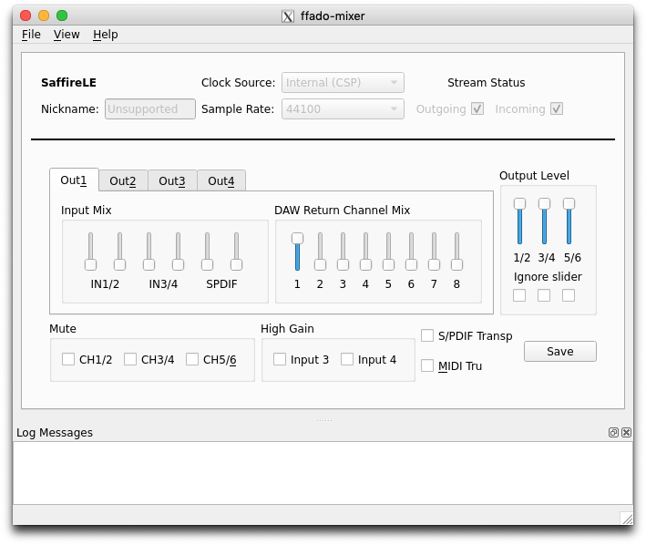

# Firewire audio interfaces

Firewire professional audio interfaces are optimal for multiway filtering, and prices are really low in second hand market in current days. An interesting scenario for Mac Mini 'linuxed' machines :-)

The `libffado2` Debian package provides a driver layer for firewire interfaces, for **model compatibility** see here:

    zcat /usr/share/doc/libffado2/README.gz | less

## FFADO for firewire audio interfaces

If you plan to use a JACK with a firewire audio interface, please install the Firewire Audio Drivers stuff (aka FFADO):

    sudo apt install libffado2 ffado-tools ffado-mixer-qt4 jackd2-firewire

### Kernel >= 4.2

Some interfaces (e.g Focusrite Saffire PRO) uses the DICE II chipset, so the O.S. will automatically load the kernel module `snd-dice` (you can check it with `lsmod`). If so, the firewire JACK backend will fail to load. To fix this, you need to blacklist the module:

    /etc/modprobe.d/blacklist.conf

        blacklist snd-dice

Anyway, for kernel >=4.2, you can leave the module `snd-dice` to be loaded, then use `jackd -d alsa` instead of `-d firewire`. Be aware to properly setup in advance the internal routing and mixer, by running the genuine Saffire PRO Mixer software under Win/Mac.

## config.yml

**Configure** your card under `config.yml` as following example, by using `-n 3` as recommended for serial interfaces:

    backend:    firewire
    device:     guid:0x00130e01000406d2
    period:     1024    # maybe you can use a smaller period size
    nperiods:   3

Use `ffado-test ListDevices` to find your card's firewire GUID.

## brutefir_config

No modifications are needed.

The Jack ports for your system card will have a new naming, but don't worry because the Jack firewire backend automagically creates aliases for regular naming `system:playback...`, see `jack_lsp firewire -A`.

## Firewire sound card mixer settings

For ALSA cards, we use `alsactl` to save our sound card settings to a file `pe.audio.sys/config/asound.MYCARD`, as prepared in advance with `alsamixer`.

So these cards settings will be restored when running `pe.audio.sys/plugins/sound_cards_prepare.py` at system restart.

For FFADO cards, this needs more manual work :-/

Basically, it is spected to found a custom made bash script for your card settings to be restored. This script does run several dbus-send commands to the fireaudio dbus system, see the provided sample file:

    ~/pe.audio.sys/config/ffado.0x00130e01000406d2.sh

        dbus-send --print-reply --dest=org.ffado.Control /org/ffado/Control/DeviceManager/00130e01000406d2/Mixer/Out12Mute org.ffado.Control.Element.Discrete.setValue int32:0
        dbus-send --print-reply --dest=org.ffado.Control /org/ffado/Control/DeviceManager/00130e01000406d2/Mixer/Out34Mute org.ffado.Control.Element.Discrete.setValue int32:0
        dbus-send --print-reply --dest=org.ffado.Control /org/ffado/Control/DeviceManager/00130e01000406d2/Mixer/Out56Mute org.ffado.Control.Element.Discrete.setValue int32:0
        ...
        ...
        ...

**You'll need to make your own script** by monitorig dBus messages in a terminal while playing with the ffado-mixer GUI, please refer to:

**http://subversion.ffado.org/wiki/ffadoMixerGuides**

(i) `ffado-dbus-server` has to be running as a background process, `start.py` will do it, but at this moment you'll need to run it in a dedicated terminal.

