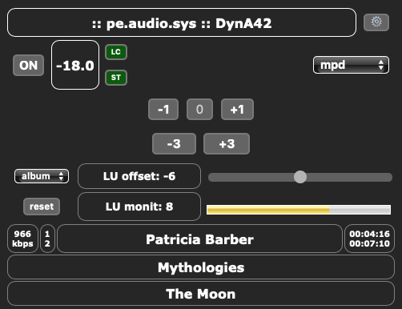

# Controlling the system

- A web page front end is provided so you can easily control the system as well your integrated music players.

- An IR interface is provided to control through by an infrared remote.

Anyway the control of the system works through by **a TCP listening socket** that accepts **a set of commands**.

Some commands have aliases to keep backwards compatibility from FIRtro or pre.di.c controllers.

## Preamp control

All commands prefixed with `preamp`. This prexix can be omited.

### Geeting help

    help                        This help

### Getting info:

    state | status | get_state  Returns the whole system status parameters,
                                as per stored within the .state file
    get_inputs                  List of available inputs
    get_eq                      Returns the current Brutefir EQ stage (freq, mag ,pha)
    get_target_sets             List of target curves sets available under the eq folder
    get_drc_sets                List of drc sets available under the loudspeaker folder
    get_xo_sets                 List of xover sets available under the loudspeaker folder

### Selector stage:

    input | source  <name>
    solo            off |  l  | r
    mono            off | on  | toggle      ( aka midside => mid )
    midside         off | mid | side
    polarity        ++  | +-  | -+  | --    LR polarity
    mute            off | on  | toggle

### Gain and Eq stage:

    level | volume  xx [add]               'xx' in dB, use 'add' for a relative adjustment
    balance         xx [add]
    treble          xx [add]
    bass            xx [add]
    lu_offset       xx [add]
    loudness        on | off | toggle       Equal loudness contour correction
    set_target       <name>                 Selects a target curve

### Convolver stages:

    set_drc | drc    <name>                 Selects a DRC FIR set
    set_xo  | xo     <name>                 Selects a XOVER FIR set

### Energy saving:

    powersave        on | off               Enables auto switching off the convolver when the
                                            preamp signal drops below a noise floor for a while

## Music players control

All commands prefixed with `player`:

    state                                   Gets the playback state: play, pause or stop.

    stop | pause | play | play_track_NN
    next | previous | rew | ff              Controls the playback

    eject                                   Ejects the CD tray

    http://url                              Plays the internet audio stream from a given url

    load_playlist  <plist_name>             Tells the current player to load a playlist

    get_playlists                           Gets the available playlist from the current player

    get_meta                                Gets metadata info from current player if available

## Miscel controls

All commands prefixed with `aux`:

    amp_switch   on | off                   Switch an amplifier

    LU_monitor_reset                        Force to reset the LU-I measure

    get_LU_monitor                          Gets the monitored LU-I value and scope

    set_LU_monitor_scope  album | track     Choose the LU-I metering scope

    add_delay   xx                          Delays xx ms the sound card outputs, e.g for multiroom listening

# Monitoring the system

The provided web page will show the system status as well music player's information.

An LCD service is provided to plug a LCD display to show the system status as well metadata from players.

You can also use the above getting info commands, through by a TCP connection.

## Monitorig the EBU R128 LU-I Integrated Loudness of the audio signal

Most music rock and pop kind of records from 80's onwards have been mastered under the 'loudness war' age.

To deal with this, you can load an optional script `loudness_monitor.py` under your `config.yml` preferences.

This script will automatically measure the EBU R128 LU-I Integrated Loudness of the current preamp source.

The monitored value will be available in several flavours:

- A graphic bar 'LU monitor' is displayed inside the control web page.
- The LCD will also display the 'LUmon' value.
- By a special command: `aux get_LU_monitor`.

A **reset** function is also provided for the monitored LU value, by a web button or by command line.

An auto reset will occur when **changing the preamp input**. In addition, the LU value could be reset also when **the played album or title (track) changes** (option inside `config.yml`).

To compensate for high LU-Integrated values on your listening audio program, we provide some options:

- The control web offers a 'LU offset' slider for you to compensate the displayed LU monitor value: simply adjust the slider as per the displayed bar span. For convenience, the adjusted value steps in 3 dB from 0 to 12 dB.
- You can preset an estimated 'lu_offset' value under your favourite sources inside `config.yml`
- You can prepare your own macros (linked to control web buttons). For instance you can set 0 dB for classical radio stations, or say about 9 dB for pop & rock radio stations.

This way, the loudness compensation feature of the calibrated volume control of pe.audio.sys will apply the appropriate contour curve when you listen below your reference SPL (level = 0 dBSPL).

It is planned to provide a servo feature for tracking the monitored LU then auto adjust the LU offset compensation.

## Monitoring Brutefir convolver clipping

Brutefir peaks should never occur.

If peaks occurs, you can see them inside the brutefir log file:

    ~/pe.audio.sys/log/brutefir.log

A **`peak_monitor.py`** plugin is provided for WARNING when detecting peaks. 

    
# Tools

Some nice tools are provided under your `~/bin` folder, below a brief description.

    $HOME/bin/
          |
     ____/
    /
    |-- peaudiosys_control                  A command line tool to issue commands to the system
    |
    |-- peaudiosys_server_restart.sh        Restart or stop the server (use --help for usage howto)
    |
    |-- peaudiosys_view_brutefir.py         Shows the running Brutefir configuration:
    |                                       mapping to sound card ports, coeffs and filters running
    |
    |-- peaudiosys_plot_brutefir_eq.py      Plot the runtime EQ module in Brutefir
    |
    |-- peaudiosys_plot_eq_curves.py        A tool to plot the curves under the share/eq folder

Advanced tools to prepare preamp eq stuff can be found in `http://AudioHumLab/audiotools/brutefir_eq`.
