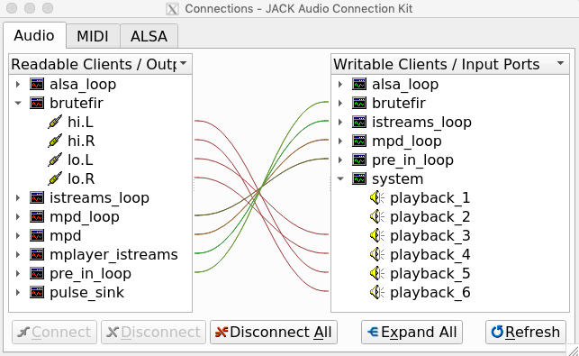

# Filesystem tree

All files are hosted under **`$HOME/pe.audio.sys`**, so that you can run `pe.audio.sys` under any user name.

That way you can keep any `~/bin` an other files and directories under your home directory.

1st level contains the firsthand files (system configuration and the system start script) and the firsthand folders (loudspeakers, user macros).

Deeper `share/` levels contains runtime files you don't usually need to access to.

    $HOME/pe.audio.sys/
          |
     ____/
    /
    |-- start.py            Startup or shutdown the whole system
    |
    |-- README.md           This file
    |
    |-- pasysctrl.hlp       Plain text about help on system control commands
    |
    |-- .state              Keeps the run-time system state
    |
    |-- log/                System log files
    |   |
    |   |-- start.log
    |   |-- peaudiosys_cmd.log
    |   |-- ...
    |
    |-- config/
    |   |
    |   |-- config.yml      The main configuration file
    |   |
    |   |-- xxxx.yml        Other configuration files
    |   |
    |   |-- asound.XXX      ALSA sound cards restore settings, see scripts/sound_cards_prepare.py
    |
    |-- macros/             End user general purpose macro scripts (e.g. web interface buttons)
    |
    |-- doc/                Support documents
    |
    |-- loudspeakers/       
    |   |
    |   |-- lspk1/          Loudspeaker files: brutefir_config, xo & drc pcm FIRs
    |   |-- lspk2/
    |   |-- ...
    |
    \-- share/              Main py files and system folders
        |
        |-- audiotools/     Auxiliary programs from the AudioHumLab/audiotools repository
        |
        |-- eq/             Shared tone, loudness and target curves .dat files
        |
        |-- services/       Services to manage the whole system
        |
        |-- scripts/        Additional scripts to launch at start up when issued at config.yml,
        |                   (i) Advanced users can hold their own scripts here.
        |
        |-- miscel/         Common usage system files
        |
        \-- www/            A web interface to control the system

# Configuration: the `config.yml` file

All system features are configured under **`config.yml`**.

We provide a **`config.yml.sample`** with clarifying comments, please take a look on it because you'll find there some useful info.

Few user scripts or shared modules can have its own `xxx.yml` file of the same base name for configuration if necessary.

This file allows to configure the whole system.

Some points:

- The necessary preamp **loop ports** will be auto spawn under JACK when source `jack_pname` is named `xxx_loop` under the `sources:` section, so your player scripts have not to be aware of create loops, just configure the players to point to these preamp loops accordingly.

- You can force some audio **settings at start up**, see `init_xxxxx` options.

- You can force some audio **settings when change the input source**, see `on_change_input:` section.

Here you are an uncommented bare example of `config.yml`:

    jack:
        backend:    alsa
        device:     hw:USBCARD,0
        period:     1024
        nperiods:   2
        miscel:
        external_cards:

    balance_max:       6.0
    gain_max:          0.0
    eq_loud_ceil:      false
    bfeq_linear_phase: false

    loudspeaker:    SeasFlat
    refSPL:         83
    ref_level_gain: -10.0

    on_init:
        xo:                 mp
        drc:                mp_multipV1
        target:             B&K
        level:              
        max_level:          -20
        muted:              false
        bass:               0
        treble:             0
        balance:            0
        subsonic:           'off'
        equal_loudness:     true
        lu_offset:          6.0     # most records suffers loudness war mastering
        midside:            'off'
        solo:               'off'
        input:              'mpd'

    run_macro: '7_mpd_play_mylist'

    on_change_input:
        bass:               0.0
        treble:             0.0
        equal_loudness:     True
        lu_offset:          6.0     # most records suffers loudness war mastering
        midside:           'off'
        solo:              'off'

    sources:
    
        spotify:
            jack_pname:    alsa_loop
            gain:           0.0
            xo:             lp
        mpd:
            jack_pname:     mpd
            gain:           0.0
            xo:             lp
        istreams:
            jack_pname:     mplayer_istreams
            gain:           0.0
            xo:             lp
        tv:
            jack_pname:     system
            gain:           +6.0                # low level source
            xo:             mp                  # low latency filtering
            target:         none                # preferred for movie dialogue
        remote:
            jack_pname:     192.168.1.234       # remote zita-j2n sender
            gain:           0.0
            xo:             lp

    source_monitors:

    scripts:
        - sound_cards_prepare.py
        - mpd.py
        - istreams.py
        - pulseaudio-jack-sink.py
        - librespot.py

    peaudiosys_address:     localhost
    peaudiosys_port:        9990

    amp_manager:            /home/predic/bin/ampli.sh
    amp_off_stops_player:   true

    web_config:
        hide_LU: false
        show_graphs: true
        main_selector: 'inputs'
        
    LU_reset_scope: album

    cdrom_device:  /dev/cdrom

    powersave:              true
    powersave_noise_floor:   -70
    powersave_minutes:        10  # Time in minutes before shutting down Brutefir

    spotify_playlists_file: spotify_plists.yml
    
    auto_update: true

# The `share/eq` folder

## Smooth system EQ

This folder contains the set of curves that will be used to apply smooth EQ to the system, i.e.:

- Bass
- Treble
- Equal loudness contour
- Psychoacoustic room dimension equalization (aka 'target')

Although these curves could be pre-calculated at start up, computing the phase for the iso226:2003 0 phon ~ 90 phon magnitude curves is hard, so a set of curves will help on modest CPU systems.

(i) The `"eq"` section on your `brutefir_config` file must match the same frequency bands as inside the `share/eq/freq.dat` file. More info: https://torger.se/anders/brutefir.html#bflogic_eq

You can easily plot the system available curves under `share/eq` by using the command line tool `peaudiosys_plot_eq_curves.py`

Similar to the loudspeaker folder, some rules here must be observed when naming curve files.

The file of the frequencies where to apply the smooth eq:

- `freq.dat`

The files of the eq curves itself, `..._mag.dat` for magnitude and `..._pha.dat` for phase:

- `bass_mag.dat`, `bass_pha.dat`, `treble_mag.dat`, `treble_pha.dat` 
- `ref_XX_loudness_mag.dat`, `ref_XX_loudness_pha.dat` (as many as reference SPL you want to manage)
- `xxxxxtarget_mag.dat xxxxxxtarget_pha.dat` (as many sets as you consider)

The `xxxxx` prefix for target files is optional. Also, the system will always include the `none` target set name.

Files for bass, treble and loudness contains an array of curves in order to be able to apply a certain amount of the desired eq. The files for target does contain only one curve per file.

### Former curves `share/eq.sample.R20_ext`

From the `FIRtro` and `pre.di.c` projects by the pioneer @rripio.

- Bass, treble and target curves have a 2nd order slope
- Loudness contour curves span from 70 to 90 phon 

### Default curves `share/eq.sample.R20_audiotools`

From the `audiotools` project, **these ones are the default for you to dump inside** `share/eq/`

- Bass, treble and target curves have a 1st order slope
- Loudness contour curves spans from 0 to 90 phon, so that loudness compensation will be applied even when listening below 70 dBSPL (i.e. below level -13 dB, aka volume)

### Make your own EQ curves

by running the tools provided here:

https://github.com/AudioHumLab/audiotools/tree/master/brutefir_eq

## Optional share/eq files

If you want to use another sound processors, you can hold here some more files.

For instance, you can use Ecasound to add a parametric EQ processor before Brutefir, for more info see the section `scripts:` under the provided `config.yml.sample` file.

# The audio routing

Here you are a typical JACK wiring screenshot.

The selected source is an MPD player wich is configured to point to the mpd_loop ports.

The preamp has a unique entrance point: the pre_in_loop. This loops feeds the main audio processor, i.e Brutefir.

You can add another audio processor, e.g. an Ecasound parametric EQ plugin. We provide hera a script that INSERTS it after the pre_in_loop and before the Brutefir input.

You are free to insert any other sound processor, Jack is your friend. To automate it on start up, you can prepare an appropriate script.

Brutefir is the last element and the only one that interfaces with the sound card Jack ports. The loudspeakers are a two way set, connected at the last sound card ports. 

# The loudspeaker

Loudspeaker config files kind of from the pre.di.c project have been leaved

Only **`brutefir_config`** has to be adjusted to set the proper coeff levels and xover scheme, as well as the system card wiring and the delays on each port.

( for more info on `brutefir_config` please see `doc/Configuration.md` )

So *keep only useful files* under your loudspeaker folder, and *name them meaningfully*.

For control purposes, XO and DRC pcms will be scanned from the list of files found under the loudspeker folder.

Please name files as follows:

DRC pcm files must be named:

    drc.X.DRCSETNAME.pcm      where X must be L | R

XO pcm files must be named:

    xo.XX[.C].XOSETNAME.pcm   where XX must be:  fr | lo | mi | hi | sw
                              and channel C is OPTIONAL, can be: L | R

    Using C allows to have DEDICATED DRIVER FIR FILTERING if desired.  

    (fr: full range; lo,mi,hi: low,mid,high; sw: subwoofer)

SUBSONIC pcm files must be named:

    subsonic.mp.pcm
    subsonic.lp.pcm

    These ones are optional files, for more info see the loudspeakers folder.

Subsonic filtering is not performed under the generic EQ stage in order to ensure enough resolution, usually 4096 taps. Dedicated FIRs also allows a more specific subsonic filter design.

### Full range loudspeaker w/o correction 'xo' filter

If you want not to use any xo filter at all, you simply do:

- configure `brutefir_config` with coeff -1:

        filter "f.fr.L" {
            from_filters: "f.drc.L";
            to_outputs:   "fr.L"/0.0/+1;
            coeff:        -1;
        };

        filter "f.fr.R" {
            from_filters: "f.drc.R";
            to_outputs:   "fr.R"/0.0/+1;
            coeff:        -1;
        };

- Leave blank `xo:` inside `on_init` section from `config.yml` 

- Set  `"xo_set":""` inside the `.state` file

- Omit any `xo....pcm` file inside your loudspeaker folder.

